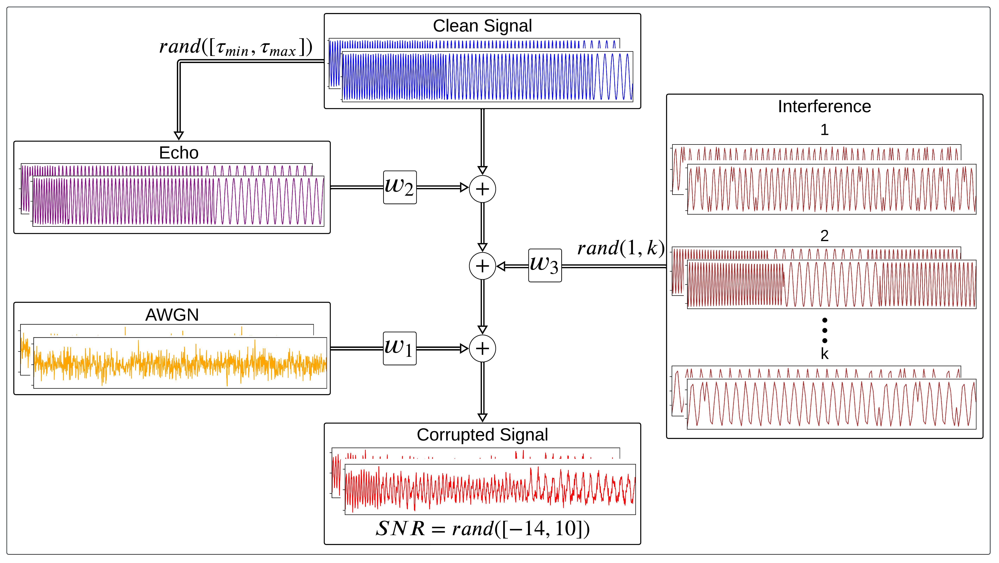
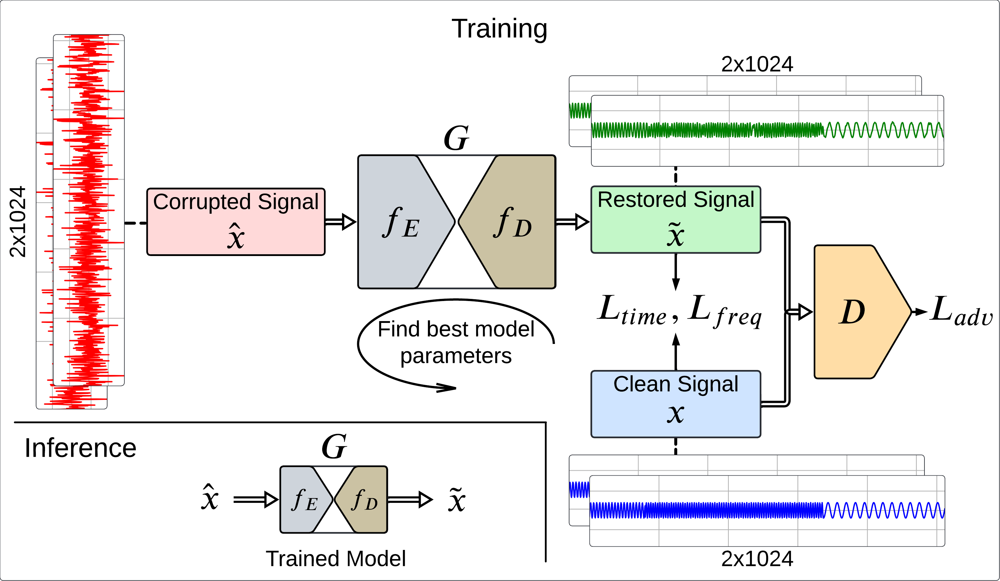
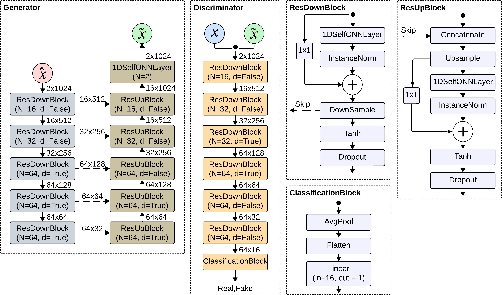
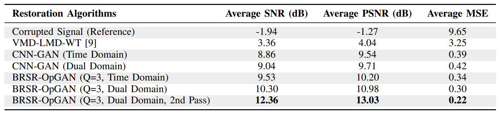
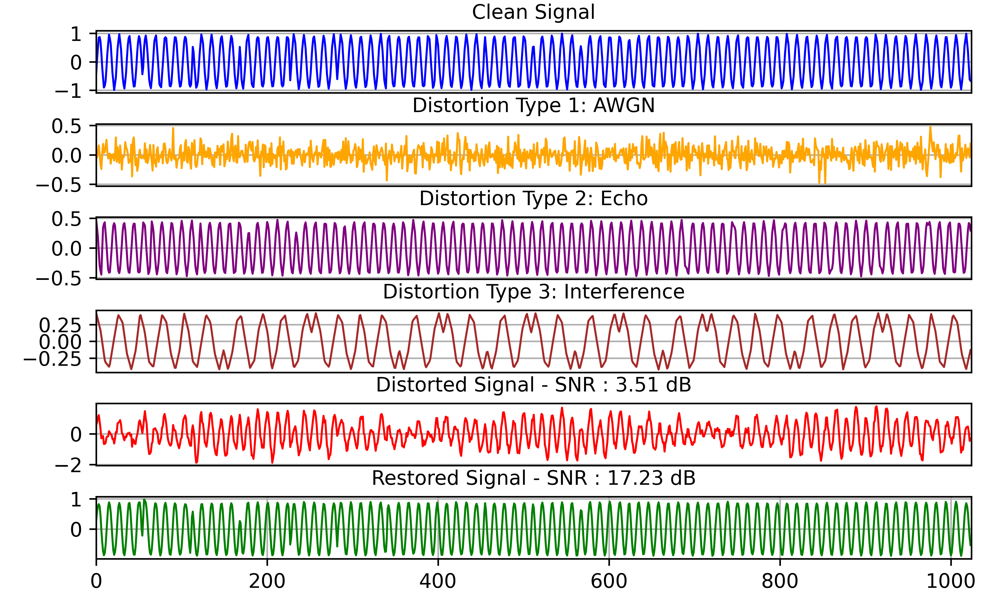

# BRSR-OpGAN: Blind Radar Signal Restoration using Operational Generative Adversarial Network

This repository contains the implementation, datasets, and results for **"BRSR-OpGAN: Blind Radar Signal Restoration using Operational Generative Adversarial Network"**. This work introduces BRSR-OpGAN, a novel generative adversarial network that addresses the challenging task of radar signal restoration under various real-world conditions, including Additive White Gaussian Noise (AWGN), interference, echoes, and composite distortions.

Radar signal restoration is essential in applications like autonomous driving, aviation, and military systems, where corrupted signals can compromise safety and functionality. The BRSR-OpGAN model leverages operational layers and a dual-domain loss function to effectively denoise radar signals, achieving significant improvements in signal-to-noise ratio (SNR) under complex noise and interference conditions.

> **Authors**: Muhammad Uzair Zahid, Serkan Kiranyaz, Alper Yildirim, Moncef Gabbouj  
> **Paper**: Available on [arXiv: https://arxiv.org/abs/2407.13949](https://arxiv.org/abs/2407.13949) 

---

## Table of Contents

- [Introduction](#introduction)
- [Repository Structure](#repository-structure)
- [Installation](#installation)
- [Running the Code](#running-the-code)
- [Dataset Generation](#dataset-generation)
- [Proposed Approach](#proposed-approach)
- [Results](#results)
- [References](#references)
- [Contact and Collaboration](#contact-and-collaboration)

---

## Introduction

Radar signal processing is crucial for safety and operational accuracy in autonomous vehicles, aviation, and military systems. However, real-world radar signals often suffer from distortions like noise, interference, and echoes, which can severely degrade performance. The **BRSR-OpGAN** model addresses this issue by restoring radar signals to their original form, improving SNR, and enabling more reliable detection and classification.

>   
> *Figure 1: Sample signals from the extended dataset demonstrating the impact of various artifacts and the effectiveness of the proposed restoration method. In
each example, the clean signal (blue) and the corrupted signal (red) are overlaid in the top plot (a), while the restored signal (green) is shown in the bottom
plot (b). Common artifacts include Additive White Gaussian Noise (AWGN), Echo, Interference, and a blend of all with randomized weights.*

---

## Repository Structure

- **`baseline_data_generator/`**: Code adapted for generating baseline radar signal data.
- **`extended_data_generator/`**: Framework for generating complex radar signal datasets with multiple types of artifacts.
- **`signal_restoration/`**: Implementation of BRSR-OpGAN for signal restoration on generated datasets.
- **`pretrained_models/`**: Contains pre-trained models optimized for signal restoration tasks.
- **`results/`**: Output files and metrics for model performance, including SNR and visual comparisons.

---

## Installation

1. **Clone the repository:**
   ```bash
   git clone https://github.com/yourusername/BRSR-OpGAN.git
   cd BRSR-OpGAN
   ```

2. **Install dependencies:**
   - Install necessary Python packages using `requirements.txt`:
     ```bash
     pip install -r requirements.txt
     ```
   - Install the **fastonn** library for Operational Neural Networks:
     ```bash
     git clone https://github.com/junaidmalik09/fastonn
     cd fastonn
     pip install .
     ```

---
## Running the Code

### 1. Data Preprocessing


### 2. Model Training and Evaluation


#### Important Arguments:


---

## Dataset Generation

The dataset generation process includes both baseline and extended datasets:

### 1. Baseline Data Generation

The **baseline data generator** creates synthetic radar signals with controlled noise (AWGN) and echo artifacts. This dataset serves as an initial benchmark for signal restoration models. Portions of the baseline dataset generation code are adapted from the following research paper:

> Jiang, Mengting, et al. "Multilayer Decomposition Denoising Empowered CNN for Radar Signal Modulation Recognition." IEEE Access (2024). [GitHub Link]

We thank the authors for their contributions to the community and acknowledge their pioneering work, which served as a foundation for the initial stages of our dataset preparation process.

### 2. Extended Data Generation

Using the `extended_data_generator/`, we introduce more complex, real-world-like artifacts. The extended dataset includes various signal corruptions with adjustable severities, such as:
   - **Additive White Gaussian Noise (AWGN)**: Simulates random noise interference.
   - **Echoes**: Mimics radar reflections, introducing signal replicas.
   - **Interference**: Emulates external signals from other radar sources.
   - **Composite Noise**: A mix of multiple artifacts for testing robustness.

The extended dataset provides a challenging environment for BRSR-OpGAN to learn adaptive restoration strategies. Below is an illustration of the dataset generation process:

>   
> *Figure 2: Illustration of extended BRSR dataset generation with a random choice of artifacts and their severities.*

---


## Proposed Approach

The BRSR-OpGAN architecture is specifically designed for **blind radar signal restoration** using a novel **dual-domain loss function** that leverages both time and frequency domains. This unique combination allows the model to retain important temporal and spectral characteristics, ensuring high-quality restoration across diverse noise types.

Key components of the BRSR-OpGAN approach include:

1. **Operational Layers**: These layers learn complex transformations for adaptive restoration, efficiently handling diverse noise and interference.
2. **Dual-Domain Loss Function**: A loss function operating across both time and frequency domains, enhancing signal fidelity.
3. **Progressive Denoising**: A two-pass denoising approach that incrementally refines signal quality.
4. **Compact Architecture**: Optimized for real-time radar applications, suitable for low-power and embedded systems.

>   
> *Figure 3: The proposed approach of BRSR-OpGAN for blind radar signal restoration.*

### Model Architecture

The BRSR-OpGAN model architecture consists of operational layers and GAN-based restoration modules, designed to learn restoration under various noise and interference types. The architecture is illustrated below:

>   
> *Figure 4: BRSR-OpGAN model architecture for radar signal restoration.*

---

## Results

The following table summarizes the SNR improvements achieved by BRSR-OpGAN under different noise and interference conditions. This comparative analysis highlights the advantages of BRSR-OpGAN over traditional methods.

>   
> *Table 4: Comparative SNR performance of BRSR-OpGAN under various noise conditions.*

Additionally, BRSR-OpGAN's qualitative restoration capabilities are shown in the examples below, illustrating significant improvement in signal clarity across diverse corruptions.

>   
> *Figure 5: Sample radar signal restoration results using BRSR-OpGAN.*

---

## References

1. Zahid, M. U., Kiranyaz, S., Yildirim, A., & Gabbouj, M. (2024). "BRSR-OpGAN: Blind Radar Signal Restoration using Operational Generative Adversarial Network." *IEEE Transactions on ...*.
2. Jiang, Mengting, et al. "Multilayer Decomposition Denoising Empowered CNN for Radar Signal Modulation Recognition." IEEE Access (2024). [GitHub Link]
3. FastONN Library: Available at [https://github.com/junaidmalik09/fastonn](https://github.com/junaidmalik09/fastonn).
4. MIT-BIH Arrhythmia Database: [https://physionet.org/content/mitdb/1.0.0/](https://physionet.org/content/mitdb/1.0.0/)

---

## Contact and Collaboration

For questions, feedback, or collaboration inquiries, please reach out to:

**Muhammad Uzair Zahid**  
Email: [muhammaduzair.zahid@tuni.fi](mailto:muhammaduzair.zahid@tuni.fi)  
LinkedIn: [https://www.linkedin.com/in/uzair-zahid/](https://www.linkedin.com/in/uzair-zahid/)
